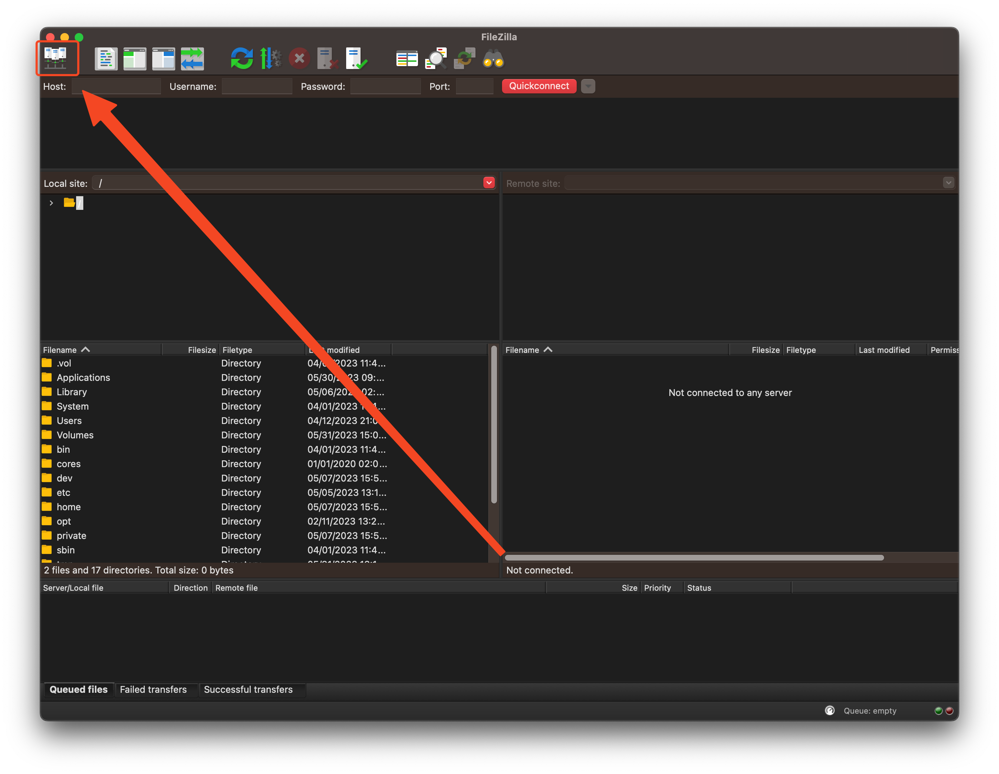
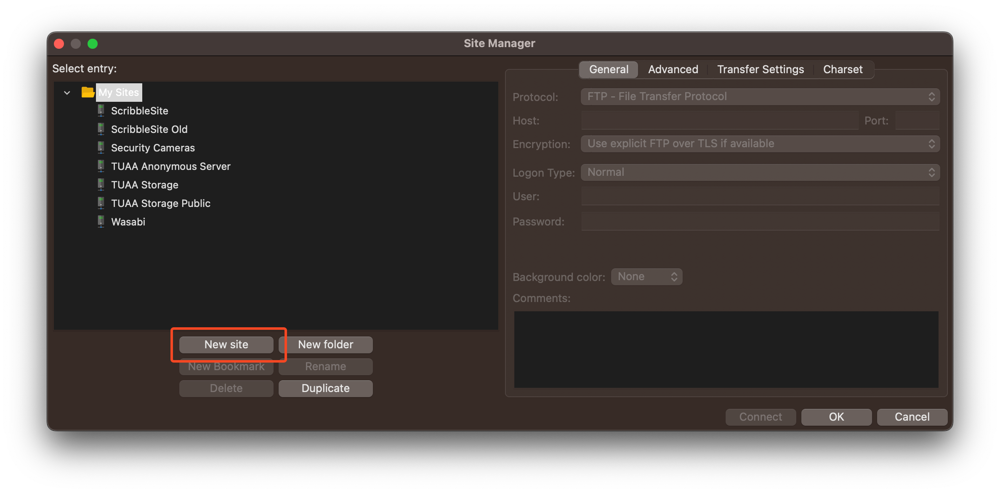
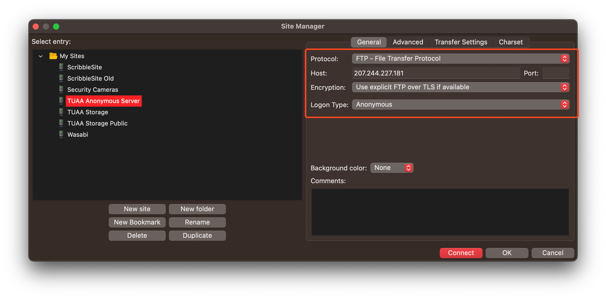
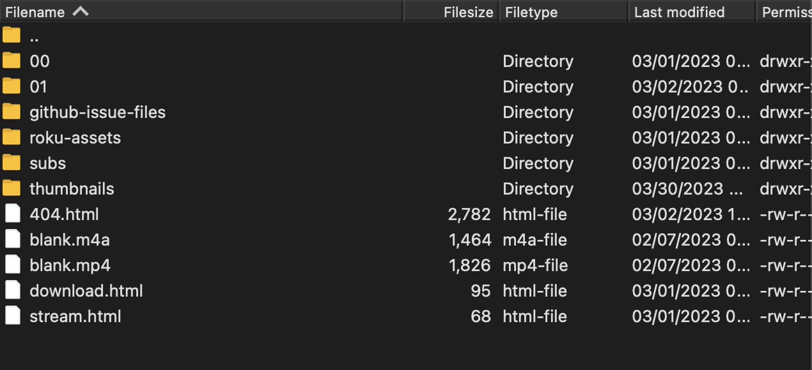
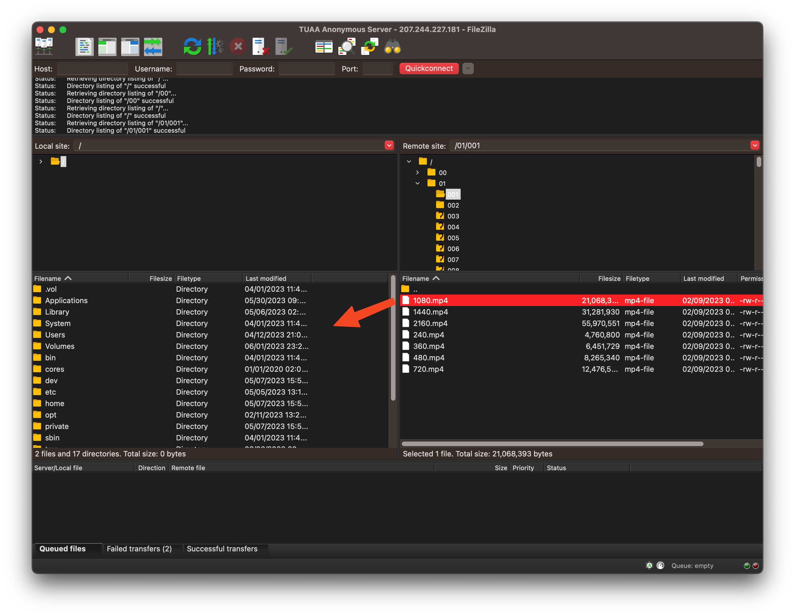

# FTP Download

One of the best ways to mass-download our content is via FTP.

## Getting Started

To get started, you will need an FTP client. In this tutorial, we will be using FileZilla, but there are many others you can use.

To download FileZilla, you will have to go to <a href="https://filezilla-project.org/download.php?type=client" target="_blank">their download page</a>, select the download link for your operating system, and install it.

After installing, click the servers button to list all your current servers.

You will then have to create a new site by clicking the "New Site" button.

Fill out the settings like the following:

- **Protocol**: FTP
- **Host**: `207.244.227.181`
- **Port**: `21` (or empty)
- **Encryption**: Use explicit FTP over TLS if available
- **Logon Type**: Anonymous

## File Structure

Hit the connect button to connect to the server. You will then see several files and folders; here's what all of them mean:

- `..`: This just goes back a directory (Some FTP clients might show this, some may not).
- `00`: This is where the episodes for the specials are stored.
- `01`: This is where the episodes for season 1 are stored.
- `github-issue-files`: This is where we upload files for GitHub issues.
- `roku-assets`: This is where assets for our unreleased Roku app are stored.
- `subs`: This is where our subtitles are stored. The sub-directories are season 0 and season 1, just like above.
- `thumbnails`: This is where our thumbnails are stored. The sub-directories are season 0 and season 1, just like above.
- `404.html`: This is just our 404 page when a user specifies an incorrect path on `download.unusann.us` or `stream.unusann.us`.
- `blank.mp4` & `blank.m4a`: These two files are what the 2nd version of our video player loads before it has found the proper video file to load.
- `download.html` & `stream.html`: These two files are loaded as the index pages for both `download.unusann.us` and `stream.unusann.us`, respectively.

## Downloading

Go to the file(s)/folder(s) you would like to download and either drag them to a file in your explorer (only on Windows), or navigate to the proper directory on the left pane and drag it in.

