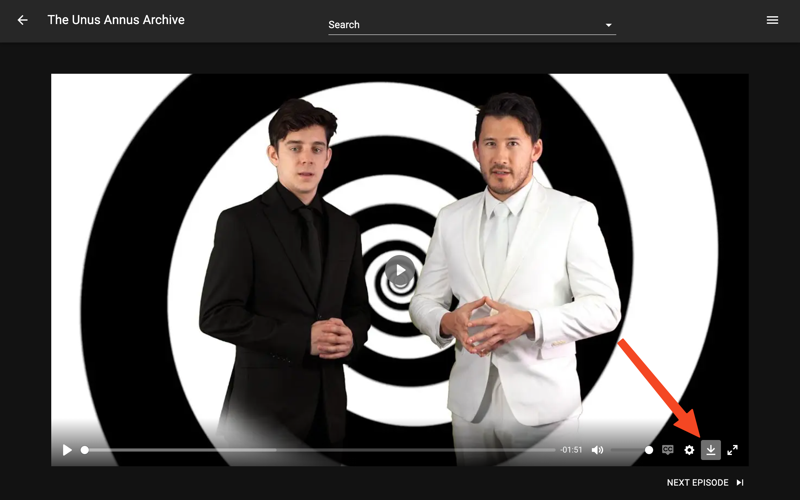
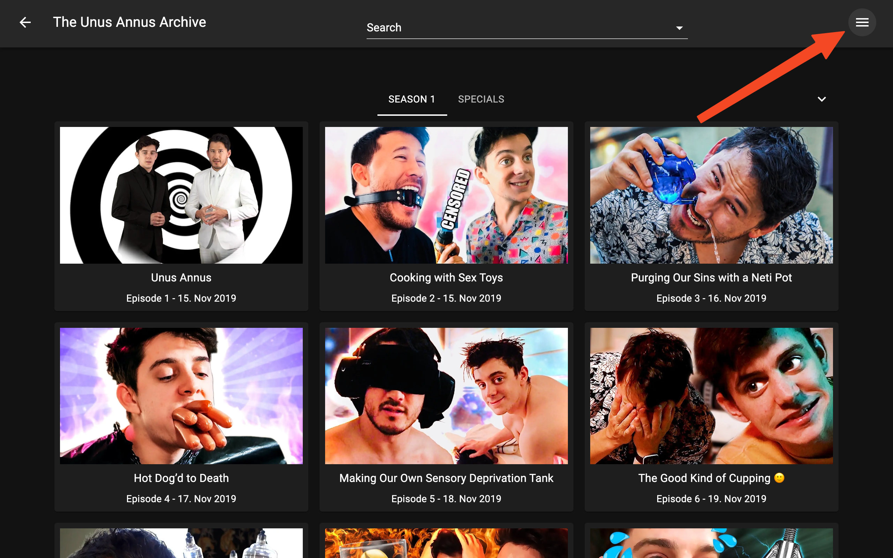
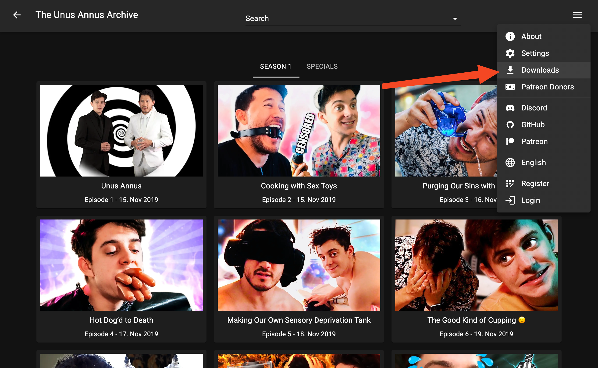
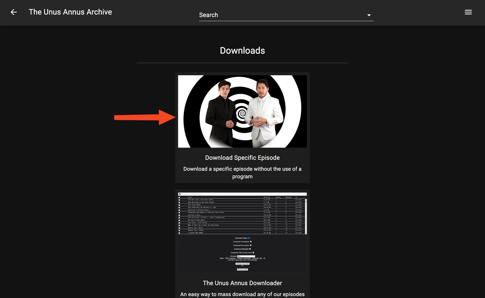

# Website

We offer a way to individually download episodes via our website, and this is a tutorial on how to do that.

## Getting Started

There are two ways to get to the downloading pane.

### Option 1

The first way to open the downloading pane is to just go to any video on the site and click the download button.

This will bring up the download options pane below the video player that will allow you to download the video.

### Option 2

The second way to open the downloading pane is to click on the three lines in the top right (or your profile picture if signed in).

Then click the `Downloads` link in the menu.

Now that you're at the downloads page, click `Download Specific Episode`, and then select the video you would like to download.

It will now show you the video's information and the download options pane.

## Downloading

Once you get to the download options pane, things are pretty self explanatory. Click on `Video` to download the video, `Subtitles` to download the subtitles, etc.

For some of the options, you have the option to copy the link as well as directly downloading it so you can use an external download manager if you wish.
